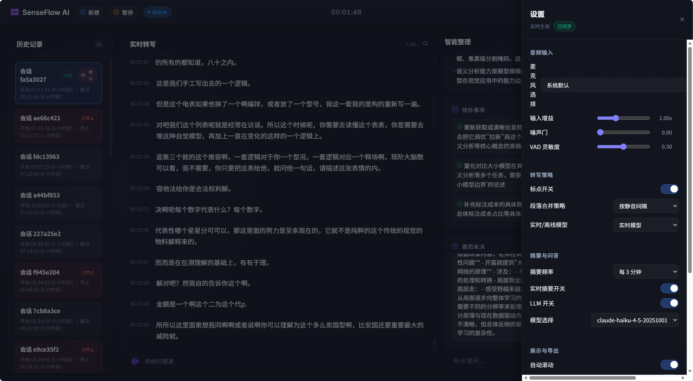

# SenseFlow Live

SenseFlow Live is a local-first, real-time speech assistant built on FunASR. It provides live transcription, session history, AI summaries, and Q&A in a single web UI.

This README focuses only on the live prototype under `prototype/`. Other folders are upstream FunASR content and are not covered here.





## Requirements
- Windows 10/11
- Conda environment with GPU-enabled PyTorch
- NVIDIA GPU with CUDA (recommended for real-time)
- Docker (optional, for MongoDB history)
- Optional LLM endpoint (OpenAI-compatible HTTP or Claude CLI as configured in `prototype/ws_server.py`)

## Models and folders
Place the required models under `models/models/damo/`:

```
models/
  models/
    damo/
      speech_paraformer-large_asr_nat-zh-cn-16k-common-vocab8404-online/
      speech_paraformer-large_asr_nat-zh-cn-16k-common-vocab8404-pytorch/
      speech_fsmn_vad_zh-cn-16k-common-pytorch/
      punc_ct-transformer_zh-cn-common-vocab272727-pytorch/
```

If your models live elsewhere, update `prototype/ws_server.py` and `prototype/asr_engine/engine.py` to point to the correct paths.

## Quick start (Windows)
1. Check Python path in `start_senseflow.ps1`:
   - Default: `E:\conda_envs\envs\funasr\python.exe`
2. Start services (uses Docker to launch MongoDB):
   ```
   powershell -ExecutionPolicy Bypass -File .\start_senseflow.ps1
   ```
3. Open the UI:
   - `prototype/index_live.html` in your browser

No Docker option (no history persistence):
```
$env:MONGO_ENABLED="0"
E:\conda_envs\envs\funasr\python.exe prototype\ws_server.py
```

## UI guide
Header
- New: start a new session (history split by session id)
- Pause/Resume: pause or resume server-side audio capture
- Status pill: connection and listening state
- Timer: elapsed time for the active session
- Settings: open the settings drawer
- Export: download the current session (format follows Settings)

History
- Left list shows sessions stored in MongoDB
- LIVE tag marks the current active session
- Terminate button appears only on the LIVE session; once terminated, transcription and insights stop for that session
- Terminated sessions show a red badge
- Clicking a session loads its transcript, summaries, and Q&A

Realtime transcript
- Draft text is low-contrast (partial)
- Final text is full-contrast
- Bottom bar shows the current listening draft

Insights
- Overall summary
- Live summary (can be hidden in Settings)
- Action items
- Open questions

Q&A
- Works for any session; historical Q&A uses transcript + insights loaded from MongoDB
- Disabled when LLM is turned off in Settings

## Settings
Audio input
- Microphone selection (from server device list)
- Input gain
- Noise gate
- VAD sensitivity

Transcription
- Punctuation toggle (server-side)
- Merge strategy (UI placeholder)
- Realtime/offline mode
  - Realtime: outputs partials
  - Offline: disables partials, only final segments

Summary and Q&A
- Summary interval (time-based)
- Live summary toggle (UI)
- LLM enable toggle
- Model selection (updates LLM model name)

Display and export
- Auto scroll (manual scroll pauses for 5 seconds before resuming)
- Show timestamps
- Export format: Markdown, JSON, or Text

Storage
- Mongo enable toggle
- Retention days
- Max size (MB)
- Auto cleanup (runs on change and every 5 minutes)

## Logs and data
- Logs: `prototype/logs/`
- MongoDB: database `senseflow_live`, collection `events`

## Troubleshooting
- No transcription: check Pause state, noise gate, mic selection, and model paths
- No summaries/Q&A: enable LLM in Settings and verify LLM endpoint in `prototype/ws_server.py`
- History empty: Mongo disabled or not running
- WebSocket errors: ensure `ws://127.0.0.1:8766` is reachable

## License
See `LICENSE`.
