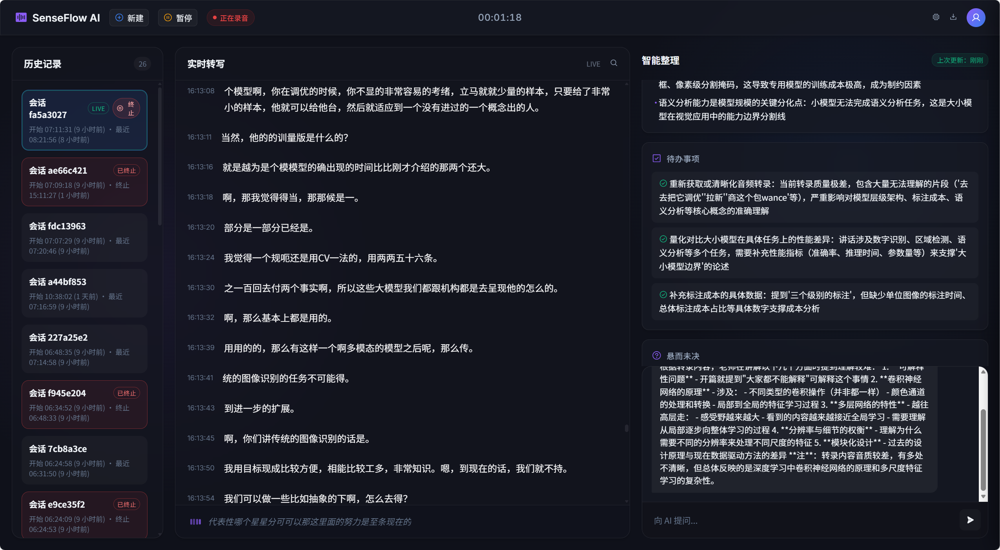

# SenseFlow Live

SenseFlow Live 是基于 FunASR 的本地实时语音助手，提供实时转写、会话历史、AI 摘要与问答的统一 Web 界面。

本 README 仅覆盖 `prototype/` 下的实时原型。仓库中其余内容为上游 FunASR 资料，这里不展开。





## 运行要求
- Windows 10/11
- Conda 环境 + GPU 版 PyTorch
- NVIDIA GPU + CUDA（实时转写推荐）
- Docker（可选，仅用于 MongoDB 历史记录）
- 可选 LLM 接口（OpenAI 兼容 HTTP 或 Claude CLI，配置在 `prototype/ws_server.py`）

## 模型与目录
将模型放到 `models/models/damo/`，结构如下：

```
models/
  models/
    damo/
      speech_paraformer-large_asr_nat-zh-cn-16k-common-vocab8404-online/
      speech_paraformer-large_asr_nat-zh-cn-16k-common-vocab8404-pytorch/
      speech_fsmn_vad_zh-cn-16k-common-pytorch/
      punc_ct-transformer_zh-cn-common-vocab272727-pytorch/
```

如果你的模型目录不同，请更新：
- `prototype/asr_engine/engine.py` 内 `ASRConfig.model_base`
- `prototype/ws_server.py` 内 `final_decode_model`

## 快速启动（Windows）
1. 检查 `start_senseflow.ps1` 的 Python 路径（默认：`E:\conda_envs\envs\funasr\python.exe`）
2. 启动服务（会自动启动 MongoDB 容器）：
   ```
   powershell -ExecutionPolicy Bypass -File .\start_senseflow.ps1
   ```
3. 打开 UI：`prototype/index_live.html`

无 Docker 的启动方式（不保留历史记录）：
```
$env:MONGO_ENABLED="0"
E:\conda_envs\envs\funasr\python.exe prototype\ws_server.py
```

## 页面功能
顶部操作
- New：新建会话（生成新的历史记录）
- Pause/Resume：暂停/继续服务端录音
- 状态指示：连接/监听状态
- 计时器：当前会话时长
- Settings：打开设置面板
- Export：下载当前会话（格式跟随设置）

历史列表
- 左侧列表显示 MongoDB 中的会话
- LIVE 标记当前会话
- 终止按钮仅在 LIVE 会话显示，终止后该会话不再转写与生成摘要
- 已终止的会话会显示红色标记
- 点击历史会话可回看转写、摘要与问答

实时转写
- Draft 为低对比度文本（partial）
- Final 为最终文本
- 底部栏显示当前监听的草稿文本

智能整理
- Overall Summary（整体摘要）
- Live Summary（实时摘要，可在设置中隐藏）
- Action Items（待办）
- Open Questions（未决问题）

问答
- 支持所有会话问答；历史问答会从 MongoDB 读取转写与摘要
- 关闭 LLM 时禁用

## 设置说明
音频输入
- 麦克风选择
- 输入增益
- 噪声门
- VAD 灵敏度

转写策略
- 标点开关（服务端生效）
- 段落合并策略（前端占位）
- 实时/离线模式
  - 实时：输出 partial
  - 离线：仅输出 final

摘要与问答
- 摘要频率
- 实时摘要开关（前端）
- LLM 开关
- LLM 模型名

展示与导出
- 自动滚动（手动滚动后 5 秒无操作再恢复）
- 时间戳显示
- 导出格式（Markdown/JSON/纯文本）

存储
- 是否写入 Mongo
- 最大保留天数/大小
- 自动清理（修改后立即执行，并每 5 分钟定期执行）

## 日志与数据
- 日志目录：`prototype/logs/`
- MongoDB：`senseflow_live.events`

## 常见问题
- 没有转写：检查暂停状态、噪声门、麦克风选择、模型路径
- 没有摘要/问答：确保 LLM 开启且 `prototype/ws_server.py` 的 LLM 配置可用
- 历史为空：Mongo 未开启或未运行
- WebSocket 失败：确认 `ws://127.0.0.1:8766` 可访问

## 许可协议
查看 `LICENSE`。
